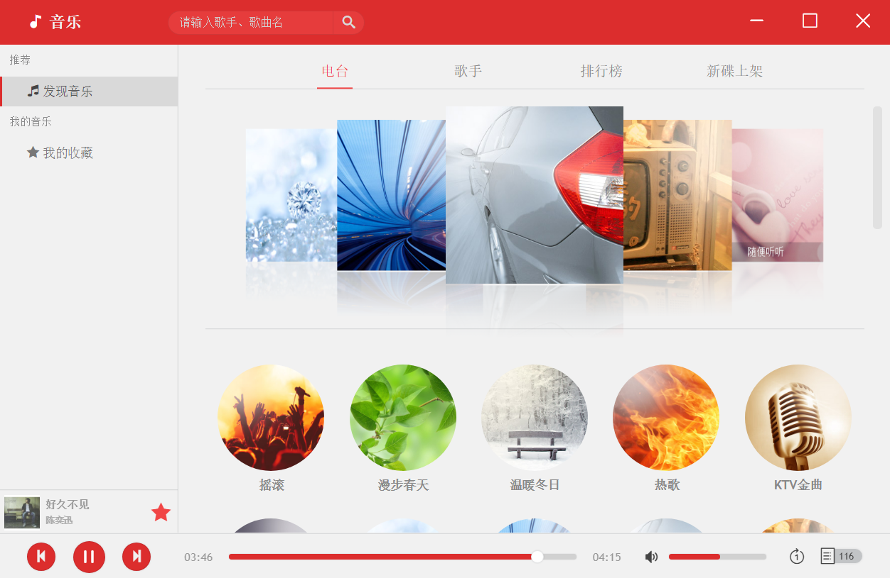

# bili music


### 软件介绍
bili music 是一个使用electron-vue模版开发的桌面端音乐程序，支持windows, mac, linux等平台。

***

### 使用技术
electron, es6, vue全家桶, webpack, jsonp, stylus

***

### 下载地址
https://pan.baidu.com/s/1NYn7Fhw-D71ZLSnovv-9tg

***

### 界面预览图



---
## Build Setup

``` bash
# install dependencies
npm install

# serve with hot reload at localhost:9080
npm run dev

# build electron application for production
npm run build


# lint all JS/Vue component files in `src/`
npm run lint

```

This project was generated with [electron-vue](https://github.com/SimulatedGREG/electron-vue) using [vue-cli](https://github.com/vuejs/vue-cli). Documentation about the original structure can be found [here](https://simulatedgreg.gitbooks.io/electron-vue/content/index.html).
